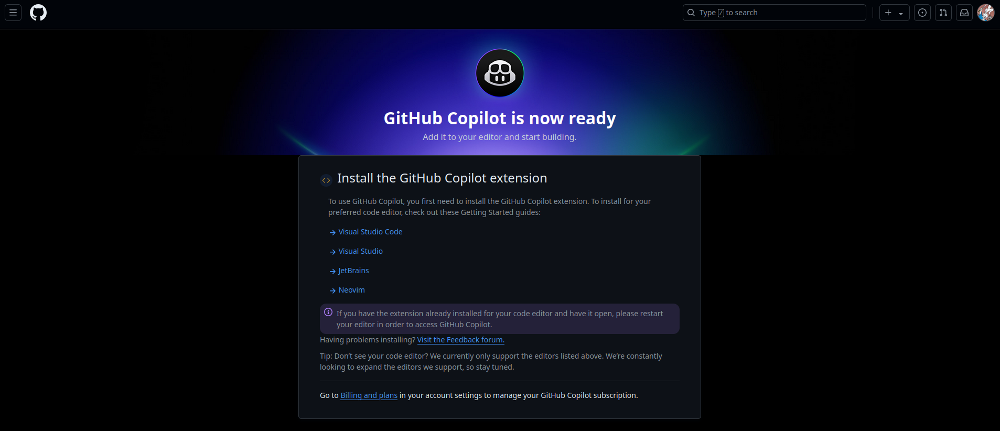
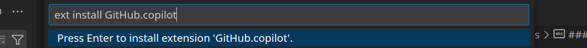
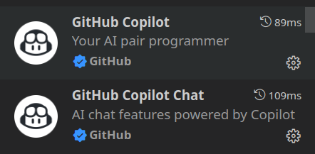
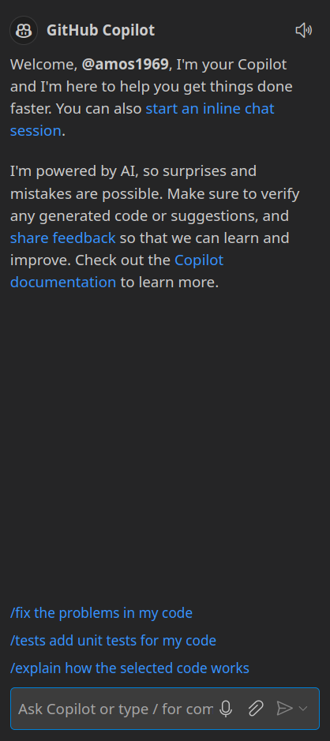
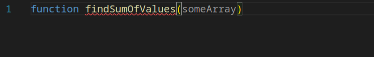
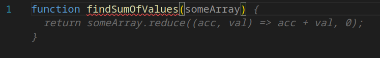
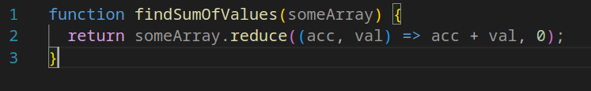
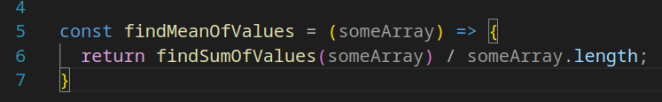
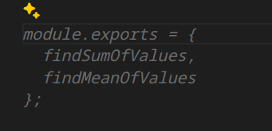
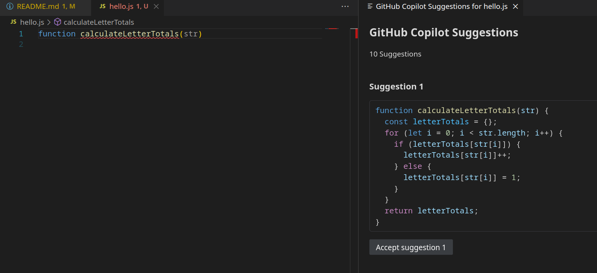

# AI for Software Development Day 1 Workshop

## Learning Objectives

- Learn about LLMs and other AI tools
- Discover the implications and limitations of using AI to develop code including Security and Compliance
- Learn how to get started with GitHub Copilot in VS Code
- Learn how to create React Projects to solve specific problems using Copilot
- Learn to use Copilot to summarise React Projects

### LLMs and Other AI Tools

### Using AI in Personal and Professional Projects

### Getting Started with GitHub Copilot in VS Code

You will need to signup for a Copilot account, if you haven't previously used up the Free Trial then you get 30 days free, before it starts costing you $10 per month. If you created a new GitHub account to use for this course, then you will probably be able to access Copilot's Free Trial from there even if you have previously used it elsewhere.

Details and a link to follow can be found here: [https://github.com/features/copilot/plans](https://github.com/features/copilot/plans)

Once you complete the signup process you'll see a page similar to this one:

Click on the first link and it will take you to a page which has some getting started instructions on it. If you follow the link you receive in your email, then it takes you to a page with the actual VS Code installation instructions. Essentially start VS Code, use `Ctrl+P` to open the Command Palette. Type `ext install GitHub.copilot` in there and hit enter, it should do the rest.

This adds two new Extensions `GitHub Copilot` and `GitHub Copilot Chat`

along with a new icon at the bottom on the left, for the Chat functionality.

When I click on the chat icon it opens up a similar window to this at the side.

There is an icon in the bottom bar which shows the current status of GitHub Copilot, this may or not be showing as `Disabled` depending on the context of what you're working on and which tabs are currently in focus.

Try opening a new JavaScript file in VS Code, lets call it hello.js or something similar. I then started by typing `function findSumOfValues(someArray)`

as I typed the final bracket Copilot showed me the following suggestion:

hitting the `Tab` key then completes the function as shown.

Just starting to type a new function using one of the other syntaxes is enough for it to start to suggest the function signature and then to complete it once you've accepted that too.

At the end of the file it also suggests what module exports will be needed to be able to use both functions elsewhere in out code.

If the initial suggestion isn't the one you're looking for, hovering your mouse over the suggestion will bring up a dialog allowing you to skip between the different options on offer.

You can open up a bigger dialog which will show you more options for you to choose from, as you're typing in hit `Ctrl-Enter` and a new tab will open with various choices in, each of which will have a button to accept the option under it.

You can also accept partial completion of the suggestions by accepting just the word your cursor is indicating. The button for this is in the same dialog we opened previously when we hovered the mouse over the suggestion.

#### Task

Play with the prompts for a while and see what you can get them to do, we'll look at some more complex interactions shortly.
