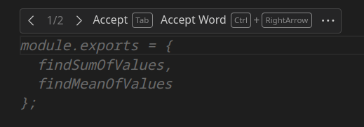

# AI for Software Development Day 1 Workshop

## Learning Objectives

- Learn about LLMs and other AI tools
- Discover the implications and limitations of using AI to develop code including Security and Compliance
- Learn how to get started with GitHub Copilot in VS Code
- Learn how to create React Projects to solve specific problems using Copilot
- Learn to use Copilot to summarise React Projects

### LLMs and Other AI Tools

### Using AI in Personal and Professional Projects

### Getting Started with GitHub Copilot in VS Code

You will need to signup for a Copilot account, if you haven't previously used up the Free Trial then you get 30 days free, before it starts costing you $10 per month. If you created a new GitHub account to use for this course, then you will probably be able to access Copilot's Free Trial from there even if you have previously used it elsewhere.

Details and a link to follow can be found here: [https://github.com/features/copilot/plans](https://github.com/features/copilot/plans)

Once you complete the signup process you'll see a page similar to this one:


Click on the first link and it will take you to a page which has some getting started instructions on it. If you follow the link you receive in your email, then it takes you to a page with the actual VS Code installation instructions. Essentially start VS Code, use `Ctrl+P` to open the Command Palette. Type `ext install GitHub.copilot` in there and hit enter, it should do the rest.


This adds two new Extensions `GitHub Copilot` and `GitHub Copilot Chat`


along with a new icon at the bottom on the left, for the Chat functionality.


When I click on the chat icon it opens up a similar window to this at the side.


There is an icon in the bottom bar which shows the current status of GitHub Copilot, this may or not be showing as `Disabled` depending on the context of what you're working on and which tabs are currently in focus.

Try opening a new JavaScript file in VS Code, lets call it hello.js or something similar. I then started by typing `function findSumOfValues(someArray)`


as I typed the final bracket Copilot showed me the following suggestion:


hitting the `Tab` key then completes the function as shown.


Just starting to type a new function using one of the other syntaxes is enough for it to start to suggest the function signature and then to complete it once you've accepted that too.


At the end of the file it also suggests what module exports will be needed to be able to use both functions elsewhere in out code.


If the initial suggestion isn't the one you're looking for, hovering your mouse over the suggestion will bring up a dialog allowing you to skip between the different options on offer.



You can open up a bigger dialog which will show you more options for you to choose from, as you're typing in hit `Ctrl-Enter` and a new tab will open with various choices in, each of which will have a button to accept the option under it.


You can also accept partial completion of the suggestions by accepting just the word your cursor is indicating. The button for this is in the same dialog we opened previously when we hovered the mouse over the suggestion.

We can also supply information to Copilot via comments as natural language which Copilot will then attempt to generate code for. Try the following:

```javascript
// Write a function to get a 
// number from the user 
// it will return triple the 
// number plus one
```

If a suggestion doesn't appear when you initially type the comment, try adding at least one empty line after the comment and see if that triggers it. From there choosing and accepting the appropriate code suggestion is the same as before.

#### Task

Play with the prompts for a while and see what you can get them to do, we'll look at some more complex interactions shortly. Have a look at some of our previous exercises and see if you can use Copilot to create the solutions, for this attempt try to do it by just generating each function separately as you go.

### More Complex Interactions with Copilot

With your JS file open and in focus, type `Ctrl-I` to open a dialog box like the following:


Typing a `/` into the box will bring up a number of command options:


Let's take a look at some simple versions of these commands. If I have the following code:

```javascript
function greeting(firstName, secondName) {
  console.log(`Hello ${firstName} ${secondName}`);
}
```

Then placing the cursor anywhere inside the function and doing `Ctrl-I` followed by `/doc` generates the following:


and accepting it, places the comment at the beginning. If there were problems with the content I could either modify it via Copilot itself or manually go in and edit the comment afterwards.

```javascript
/**
 * Prints a greeting message with the provided first and second names.
 *
 * @param {string} firstName - The first name.
 * @param {string} secondName - The second name.
 * @returns {void}
 */
function greeting(firstName, secondName) {
  console.log(`Hello ${firstName} ${secondName}`);
}
```

Doing the same but choosing the `/explain` option will produce a dialog with a reasonably detailed explanation of what the code is doing. The content of this could be copied and pasted somewhere useful, and again can be tweaked using the Copilot prompt. The dialog that appears also has an option to open the text in the chat tab and a reload button. If the explanation doesn't quite have enough information in it then you can try reloading it to get a different/better one.

If I change the code so that it now reads:

```javascript
function greeting(firstName, secondName) {
  console.log('Hello ${firstName} ${secondName}');
}
```

Then although the code will run when the function is called, it won't interpolate the values of `firstName` and `secondName` into the string which is output. This is because the quote marks have changed from back-ticks to single quotes. The code that is there is valid JavaScript and will not trigger an error, but it is not what the programmer intended. Copilot can help detect this subtle bug in your code (as well as fixing more straightforward syntax errors etc), make sure the cursor is inside the function definition and do `Ctrl-I` to bring up the prompt. This time type `/fix` and then check the resulting dialog.


You can choose to ignore or accept the fix and your code will be updated accordingly, you can also reload the fix in the event that it doesn't address your concern.

The fourth command option is to add tests to the existing code, let's try that now with the same greeting function, first of all make sure the previous subtle error has been corrected and then try running the `/tests` command after doing `Ctrl-I`. This will produce a new test file (in my case it was called `hello.test.js` to match the file being called `hello.js`) which has 3 tests in it. Each of these tests has comments to explain what the resulting effect should be when the function is called with the given parameters. These tests are not set up to use a testing framework like the ones we have done during the exercises and they won't be autorun by a test runner.

```javascript
// Test case 1: firstName and secondName are both provided
greeting("John", "Doe"); // Output: Hello John Doe

// Test case 2: firstName is provided, but secondName is not
greeting("Jane"); // Output: Hello Jane undefined

// Test case 3: Neither firstName nor secondName are provided
greeting(); // Output: Hello undefined undefined
```

Let's check what happens if we have a function that returns a value rather than just outputting on to the Console. Delete the previous function (and the test file that went with it) and add a simple one to return the sum of the two values passed as arguments to the function, as follows:

```javascript
function sum(a, b) {
  return a + b;
}
```

then run the command to generate tests again. In my case it gave me this:

```javascript
// Test case 1: Positive numbers
console.log(sum(2, 3)); // Expected output: 5

// Test case 2: Negative numbers
console.log(sum(-5, -7)); // Expected output: -12

// Test case 3: Zero
console.log(sum(0, 10)); // Expected output: 10

// Test case 4: Decimal numbers
console.log(sum(1.5, 2.5)); // Expected output: 4

// Test case 5: Large numbers
console.log(sum(1000000, 2000000)); // Expected output: 3000000
```

We'll come back and revisit testing later to see how easily we can generate some automated unit tests using a framework.

### Using the Copilot Chat

As well as interacting with Copilot via the Editor Window there is also a new Chat icon on the left which opens up a window where you can "chat" with Copilot in order to generate code according to your ideas. I tried the following prompts:

```Copilot
Create javascript for a 10 question multiple choice quiz. 
```

This generated code for a 10 question multiple choice quiz but by defining a Question  class, 10 instances of those questions and then code to manage that. After reading through the code I then added a second request to the Chat, without adding anything else in between:

```Copilot
Make it without classes
```

which generated the following:

```javascript
// Initialize quiz questions without using classes
const questions = [
  { text: "What is the capital of France?", options: ["A: Paris", "B: London", "C: Berlin", "D: Madrid"], answer: "A" },
  { text: "What is 2 + 2?", options: ["A: 3", "B: 4", "C: 5", "D: 6"], answer: "B" },
  { text: "Who wrote 'Hamlet'?", options: ["A: Dickens", "B: Shakespeare", "C: Hemingway", "D: Austen"], answer: "B" },
  { text: "What is the largest ocean?", options: ["A: Atlantic", "B: Indian", "C: Arctic", "D: Pacific"], answer: "D" },
  { text: "What is the capital of Japan?", options: ["A: Beijing", "B: Seoul", "C: Tokyo", "D: Bangkok"], answer: "C" },
  { text: "What is the speed of light?", options: ["A: 300,000 km/s", "B: 150,000 km/s", "C: 450,000 km/s", "D: 600,000 km/s"], answer: "A" },
  { text: "Who discovered penicillin?", options: ["A: Marie Curie", "B: Alexander Fleming", "C: Nikola Tesla", "D: Albert Einstein"], answer: "B" },
  { text: "What is the chemical symbol for gold?", options: ["A: Au", "B: Ag", "C: Fe", "D: O"], answer: "A" },
  { text: "Who painted the Mona Lisa?", options: ["A: Vincent Van Gogh", "B: Leonardo da Vinci", "C: Pablo Picasso", "D: Claude Monet"], answer: "B" },
  { text: "What is the hardest natural substance on Earth?", options: ["A: Gold", "B: Iron", "C: Diamond", "D: Quartz"], answer: "C" }
];

// Function to start the quiz
function startQuiz(questions) {
  let score = 0;

  // Loop through each question
  questions.forEach(question => {
    // Display question and options
    console.log(question.text);
    question.options.forEach(option => console.log(option));

    // Simulate user input for demonstration (replace with actual user input mechanism)
    const userInput = prompt(question.text + "\n" + question.options.join("\n"));

    // Check if the answer is correct
    if (question.answer === userInput.trim().toUpperCase()) {
      console.log("Correct!");
      score++;
    } else {
      console.log("Wrong answer!");
    }
  });

  // Display final score
  console.log(`Quiz completed! Your score is ${score}/${questions.length}.`);
}

// Uncomment the line below to start the quiz
// startQuiz(questions);
```

There is an option at the top of the response to insert this code into a new file which I recommend trying.

#### Tasks

See what other things you can get it to produce. Can you get it to tell you jokes?

### Looking at Existing Exercises

Have a look at the JS Fundamentals Functions 1 Exercise here: [https://github.com/boolean-uk/js-fundamentals-functions-1](https://github.com/boolean-uk/js-fundamentals-functions-1)

If you already have a Fork of it, then Fork it under a new name into your GitHub account, if you don't then just make a Fork as normal.

Clone the newly Forked project and then open the repo in VS Code as normal. If you open the Chat tab and ask it to `/explain` the `@workspace` it will talk about the various tools that are installed as part of the project. I tried both of the following prompts in the Chat window and got very generic responses:

```Copilot
Create code in src/calling-functions.js to pass the tests in spec/calling-functions.spec.js
```

and

```Copilot
Create code in src/creating-functions.js to pass the tests in spec/creating-functions.spec.js
```

To be fair the information given would probably help, someone who was stuck, but it definitely doesn't create a solution.

If however I go to the Chat window and click on the paperclip icon it gives me the option to attach a file to the prompt I pass to Copilot. Clicking on `creating-functions.js` to attach it and then typing `Solve these` as the prompt generates code that will solve that exercise, doing the same with `calling-functions.js` gives me a solution for that. Copying and pasting these solutions into the appropriate files allows me to make all of the tests pass.

### Open Ended Tasks

Let's try this with something more open-ended like the JavaScript FizzBuzz Challenge: [https://github.com/boolean-uk/js-fizzbuzz](https://github.com/boolean-uk/js-fizzbuzz)

Fork and Clone the repository with a new name if you already have a copy and see if you can create a solution that works just by using the Readme file.

Experiment with some of the other exercises we've worked on.

### Tests

The Framework we've been using to test our JavaScript code is called Jasmine, we can use Copilot to generate the tests for us too (this breaks the cardinal rule of Test Driven Development in that tests should be written before code to make them pass!). With the FizzBuzz code, once you have a working solution to it, try attaching the solution to the Copilot Chat and then ask Copilot to:

```Copilot
Create Jasmine based tests to test this file
```

and check out the result. To me the results are less broad than the original tests, but they cover many of the functionalities that we need to include.
